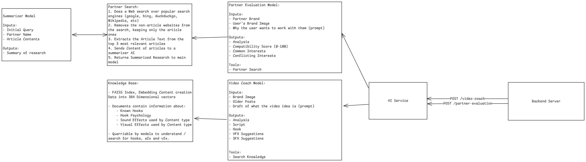

# Hackiwha 3.0 -- AI Service

The following document is a base line documentation for the AI service.

---

team_name: ONE
service_description: contains the LLM/Agent Logic behind the video-coach and partner-evaluation features of the application

---

## System Design



## Tech Stack

This project uses the following Technologies:

- Web Framework: FastAPI (python)
- Vector Database: FAISS
- Inference Hubs / AI API: Hugging Face
- LLM: Qwen3-4B-Instruct
- Web Scraping: DDGS (Search), Trafilature (Scraping)

## File Structure

`/app` : main calling code, FastAPI root + env settings
`/app/schemas` : pydantic model for common types and DTO for requests
`/data/knowledge-base` : raw english files with written short bits of knowledge
`/data/faiss-index`: FAISS index of ingested files
`/prompts`: prompts for the 3 AI models (coach, partner, summary)
`/routers` : FastAPI routers for the 2 endpoints
`/services` : Tools used by the AI Models (knowledge search, web search) + LLM Inference Hub Wrapper + Utility Functions

## Installation

### Build from docker

build the docker container using

`docker build .`

> [!warn] Data
> The libraries needed to run the AI Model are quite heavy and take a lot of data, caution is advised
> I lost all my data installing them.

The app will now listen on port 5345

### Build from source

1. Clone the repository
2. run `uv sync` to install dependencies
3. run `uvicorn app.main:app` to start the application
4. App now listening on port 8000

# API Documentation

## Types

### Brand Image

- `POST /video-coach`

- Video Coach will take in your old posts, your brand image and his own knowledge base to create you an engaging video, complete with a script and VFX and SFX ideas for editing.

Request DTO

```json
{
  "brand": {
    "visual": {
      "logo": "",
      "typography": {
        "titles": "Font1",
        "texts": "Font2",
        "extra": "Font3",
        "highlight": "Font2 Bold Italic"
      },
      "photography": "",
      "color_pallete": ""
    },
    "tone": {
      "vocabulary": "",
      "humor_level": "",
      "formality": "",
      "sentance_rhythm": ""
    },
    "positioning": {
      "target_audience": "",
      "problem_statement": "",
      "flare": ""
    }
  },
  "posts": [
    {
      "idea": "Video Idea",
      "script": "Lorem Impsum...",
      "hook": "Here is what you should NEVER do when",
      "platform": "instagram-reels",
      "is_loop": false
    }
  ],
  "prompt": "This is where the user prompts about what the video is going to be about"
}
```

Response DTO

```json
{
  "analysis": "Markdown Where the AI Explains",
  "script": "",
  "hook": "",
  "platform": "",
  "is_loop": "",
  "suggested_vfx": "",
  "suggested_sfx": "",
  "design_direction": "Color palette, typography, etc etc"
}
```

- `POST /partner-evaluation`

- Partner Eval will take in your brand image and the name of your partner + the reason you want to partner with them, it will then lookup this partner and see if they have been in any recent controversies or problems, lookup their alignment and ideals, their brand motives. Then generate a comprehensive report as to how compatible your brands are and the pros/cons of a collab.

Request DTO

```json
{
  "partner_brand": "Name of brand",
  "brand": {
    "visual": {
      "logo": "",
      "typography": {
        "titles": "Font1",
        "texts": "Font2",
        "extra": "Font3",
        "highlight": "Font2 Bold Italic"
      },

      "photography": "",

      "color_pallete": ""
    },
    "tone": {
      "vocabulary": "",
      "humor_level": "",
      "formality": "",
      "sentance_rhythm": ""
    },
    "positioning": {
      "target_audience": "",
      "problem_statement": "",
      "flare": ""
    }
  },
  "prompt": "This is where the user prompts why they want to partner up with this org, and the details of the partner ship"
}
```

Response DTO

```json
{
  "analysis": "",
  "compatibility": 100,
  "shared_intrests": ["", ""],
  "conflict_intrests": ["", ""]
}
```

# Example Requests

In the case of the full application incapable of running, here is a suite of requests you can use to test out the service.

The persona these request mock is a game dev content creator who is harsh, sarcastic and doesn't sugar coat information, just pure hard truths and pills to swallow.

## Request 1 : Video Coach

URL: http://localhost:8000/video-coach
Body (JSON):

```json
{
  "brand": {
    "visual": {
      "logo": "My Logo Description",
      "typography": {
        "titles": "Poppins Bold",
        "text": "Inter Regular",
        "extra": "Caveat",
        "highlight": "Poppins Bold Italic"
      },
      "photography": "high-contrast, moody indoor lighting, close-up shots",
      "color_palette": "#0D0D0D, #F5F5F0, #E63946"
    },
    "tone": {
      "vocabulary": "casual, direct, a bit sarcastic",
      "humor_level": "medium-high",
      "formality": "low",
      "sentence_rhythm": "short punchy sentences, occasional one-word lines"
    },
    "positioning": {
      "target_audience": "indie devs and solo founders, 20-35",
      "problem_statement": "they waste weeks building things nobody wants",
      "flare": "No Sugar coating, direct to the point and snappy"
    }
  },
  "posts": [
    {
      "idea": "Why I killed my SaaS after 3 months",
      "script": "Full transcript of the previous video...",
      "hook": "I shut down my SaaS. Here's why that was the right call.",
      "platform": "tiktok",
      "is_loop": false
    }
  ],
  "prompt": "Video about how I validate an idea in 48 hours before writing any code."
}
```

Expected Output: Detailed Report on a video idea + some tool calls to knowledge base (optional)

## Request 2 : Partner Suggestion (Compatible)

URL: http://localhost:8000/partner-evaluation

Body:

```json
{
  "brand": {
    "visual": {
      "logo": "My Logo Description",
      "typography": {
        "titles": "Poppins Bold",
        "text": "Inter Regular",
        "extra": "Caveat",
        "highlight": "Poppins Bold Italic"
      },
      "photography": "high-contrast, moody indoor lighting, close-up shots",
      "color_palette": "#0D0D0D, #F5F5F0, #E63946"
    },
    "tone": {
      "vocabulary": "casual, direct, a bit sarcastic",
      "humor_level": "medium-high",
      "formality": "low",
      "sentence_rhythm": "short punchy sentences, occasional one-word lines"
    },
    "positioning": {
      "target_audience": "indie devs and solo founders, 20-35",
      "problem_statement": "they waste weeks building things nobody wants",
      "flare": "No Sugar coating, direct to the point and snappy"
    }
  },
  "partner_brand": "Pieter Levels",
  "prompt": "Solo dev, builds in public, blunt no-fluff style, ships fast talks openly about failures and revenue. Audience near-identical to ours: indie devs and solo founders. Feels like obvious fit, want compatibility check before reach out."
}
```

Expected Output: Detailed Report on this person, high compatibility score + multiple search tool calls

## Request 3 : Partner Evaluation (Incompatible)

URL: http://localhost:8000/partner-evaluation

Body:

```json
{
  "brand": {
    "visual": {
      "logo": "My Logo Description",
      "typography": {
        "titles": "Poppins Bold",
        "text": "Inter Regular",
        "extra": "Caveat",
        "highlight": "Poppins Bold Italic"
      },
      "photography": "high-contrast, moody indoor lighting, close-up shots",
      "color_palette": "#0D0D0D, #F5F5F0, #E63946"
    },
    "tone": {
      "vocabulary": "casual, direct, a bit sarcastic",
      "humor_level": "medium-high",
      "formality": "low",
      "sentence_rhythm": "short punchy sentences, occasional one-word lines"
    },
    "positioning": {
      "target_audience": "indie devs and solo founders, 20-35",
      "problem_statement": "they waste weeks building things nobody wants",
      "flare": "No Sugar coating, direct to the point and snappy"
    }
  },

  "partner_brand": "Linus Tech Tips",
  "prompt": "Massive tech-creator channel, deadpan/direct tone, audience overlaps with our dev crowd, look like strong reach play. Want full check first — heard some past controversy around review practices and want current reputation status before commit."
}
```

Expected Output: Detailed report, Low compatibility, high amount of conflicting interests.

## Request 4: Partner Evaluation (Compatible but moral incompatible)

URL: http://localhost:8000/partner-evaluation

Body:

```json
{
  "brand": {
    "visual": {
      "logo": "My Logo Description",
      "typography": {
        "titles": "Poppins Bold",
        "text": "Inter Regular",
        "extra": "Caveat",
        "highlight": "Poppins Bold Italic"
      },
      "photography": "high-contrast, moody indoor lighting, close-up shots",
      "color_palette": "#0D0D0D, #F5F5F0, #E63946"
    },
    "tone": {
      "vocabulary": "casual, direct, a bit sarcastic",
      "humor_level": "medium-high",
      "formality": "low",
      "sentence_rhythm": "short punchy sentences, occasional one-word lines"
    },
    "positioning": {
      "target_audience": "indie devs and solo founders, 20-35",
      "problem_statement": "they waste weeks building things nobody wants",
      "flare": "No Sugar coating, direct to the point and snappy"
    }
  },

  "partner_brand": "GlowUp Wellness Co",
  "prompt": "Big engagement numbers, wellness/lifestyle niche, brand team suggest cross-promo for reach. Audience skew different from ours but numbers look tempting. Want honest read whether tone/positioning actually match before commit budget."
}
```
